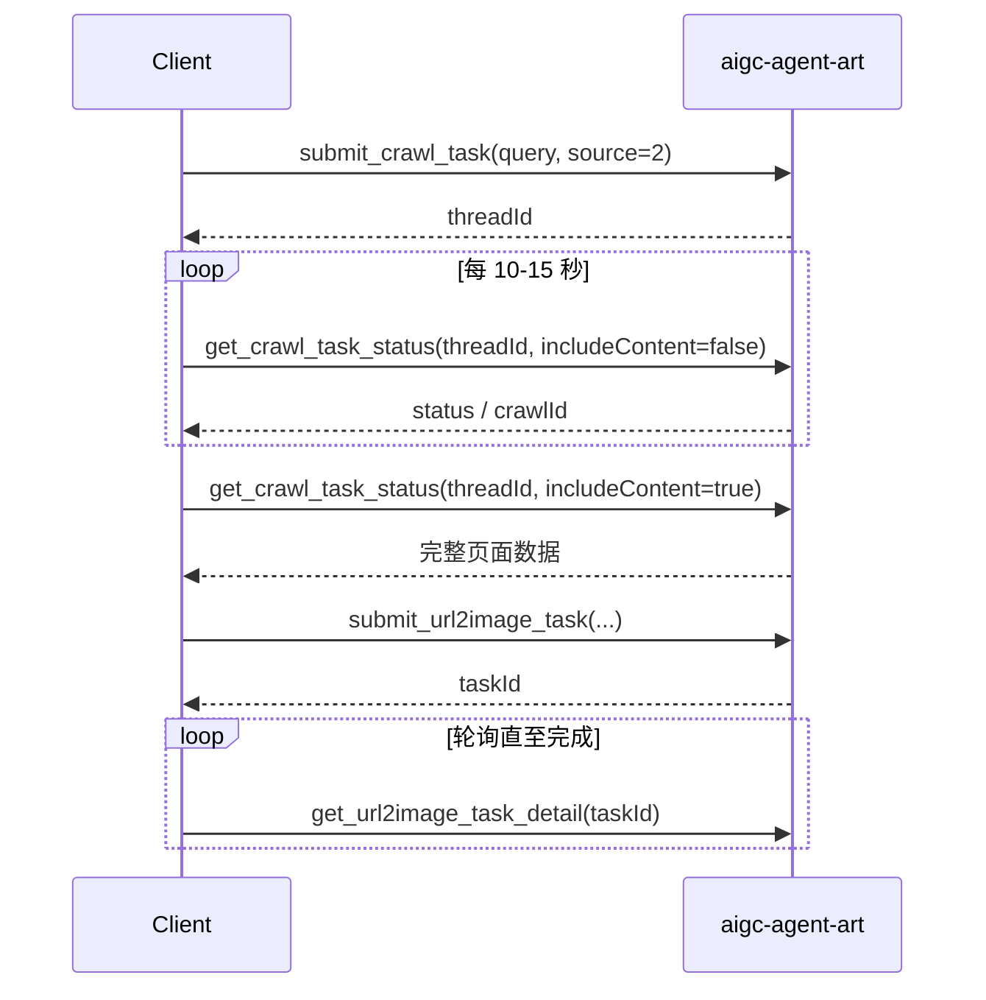

# kreadoai-mcp-skills

> [English README](./README.en.md)

KreadoAI AIGC 能力 MCP 接入文档。本文档基于 MCP 服务 **aigc-agent-art** 当前暴露的 20 个工具编写，适用于在 Cursor、Claude Desktop 等支持 MCP 的客户端中接入 KreadoAI 生图、广告创意、视频、数字人、TTS 等能力。

## 服务概览

| 项目 | 说明 |
|------|------|
| 服务名称 | `aigc-agent-art` |
| 能力范围 | AI 生图、广告创意多尺寸、URL 广告图、图/文生视频、网页采集、数字人唇形合成、TTS、字幕/水印擦除 |
| 计费 | 部分能力消耗 K 币；可通过 `get_my_user_detail` 查询余额与配额 |
| 鉴权 | 依赖会话用户上下文，无需传入 `userId`；仅能操作当前登录用户自己的任务 |

## 在 Cursor 中接入

在 Cursor 的 MCP 配置（`Settings → MCP`，或项目/用户级 `mcp.json`）中添加服务。具体连接地址与鉴权方式以 KreadoAI 官方提供的 MCP 接入信息为准，示例：

```json
{
  "mcpServers": {
    "aigc-agent-art": {
      "url": "https://api.kreadoai.com/mcp/agentart/v1/mcp",
      "headers": {
        "Authorization": "<your-token>"
      }
    }
  }
}
```

配置完成后重启 Cursor，在 Agent 对话中即可调用本服务工具。工具列表以 MCP 客户端实际同步结果为准。

## 通用约定

### 异步任务模式

多数生成类接口为**提交 + 轮询**模式：

1. 调用 `submit_*` 提交任务，获得 `taskId` / `jobId` / `threadId`
2. 周期性调用对应的 `get_*` / `batch_get_*` 查询结果
3. 根据状态字段判断是否完成

### 任务状态码

| 场景 | 状态值 | 含义 |
|------|--------|------|
| 生图 / 广告图 / URL2Image | 1 / 2 / 3 / 4 | 等待 / 执行中 / 成功 / 失败 |
| 图生视频 | 1 / 2 / 3 / 4 | 等待 / 成功 / 失败（见各工具说明） |
| 数字人 / 字幕擦除 | 1 / 2 / 3 / 4 / 5 | 等待 / 执行中 / 成功 / 失败 / 超时 |
| 网页采集 | RUNNING / SUCCESS / FAILED / NOT_FOUND | 执行中 / 成功 / 失败 / 不存在或已过期（TTL 24h） |

### 文件入参结构（fileUrlList / imageInput 等）

上传或引用文件时，常用对象字段：

| 字段 | 说明 |
|------|------|
| `fileSource` | `1`=平台已上传文件（需 `fileId`）；`2`=三方 URL（需 `fileUrl`）；`3`=base64（需 `fileUrl`） |
| `fileId` | 平台文件 ID |
| `fileUrl` | 文件 URL 或 base64 内容 |
| `fileName` | 文件名，建议有意义的命名 |
| `thumbnailFileUrl` | 缩略图 URL |

### 轮询建议

| 任务类型 | 建议间隔 | 最长等待 |
|----------|----------|----------|
| 网页采集 | 10–15 秒 | 15 分钟 |
| 图/文生视频 | 10–30 秒 | 视模型而定 |
| 生图 / 广告图 | 5–15 秒 | 视任务复杂度而定 |
| 数字人 / 字幕擦除 | 10–30 秒 | 视队列而定 |

### 限流提示

- `text_to_speech`：同一秒内仅允许 1 次请求
- `submit_system_lip_task`：每秒仅允许 1 次提交，服务端最多 8 个排队任务

---

## 工具清单

### 用户与账户

| 工具 | 说明 | 必填参数 |
|------|------|----------|
| `get_my_user_detail` | 查询当前用户账号、会员、剩余 K 币、配额等 | 无 |

### AI 图片生成

| 工具 | 说明 | 必填参数 |
|------|------|----------|
| `submit_ai_image_task` | 文生图 / 图生图，返回任务 ID | `userPrompt`, `quantity`, `modelsSource` |
| `get_ai_image_task_detail` | 查询生图任务结果 | `taskId` |
| `resubmit_ai_image_task` | 按原任务参数重新生成 | `taskId` |

**modelsSource 模型代码：**

| 值 | 模型 |
|----|------|
| 2 | google-gemini-2.5-flash-image |
| 3 | doubao-seedream-4.0 |
| 5 | google-gemini-3-pro-image |
| 6 | doubao-seedream-4.5 |
| 7 | doubao-Seedream-5.0-lite |
| 8 | google-gemini-3.1-flash-image |
| 9 | gtp-image-2（推荐优先使用较新模型） |

**常用可选参数：** `sizeRatio`（如 `16:9`、`1:1`）、`dpi`（`512`/`1k`/`2k`/`4k`）、`fileUrlList`（参考图）、`width`/`height`（豆包模型 3/6/7 必填）、`webSearch`、`seed`、`thinkingLevel`。

### 广告创意多尺寸

| 工具 | 说明 | 必填参数 |
|------|------|----------|
| `submit_ai_ad_creative_batch_image` | 上传产品图，批量输出多平台尺寸 | `fileUrlList`, `imageSizeList` |
| `get_ai_ad_creative_batch_image_detail` | 查询批量生图结果 | `taskId` |

**layout 布局：** `1`=原图布局，`2`=AI 智能排版，`3`=自定义排版（需 `referenceFileList`）。

**imageSizeList 示例：**

```json
[
  { "width": 1080, "height": 1920, "sizeRatio": "9:16" },
  { "width": 1200, "height": 628, "sizeRatio": "1.91:1" }
]
```

### URL 广告图（需先采集页面）

| 工具 | 说明 | 必填参数 |
|------|------|----------|
| `submit_crawl_task` | 抓取产品页 / 落地页 | `query`（URL） |
| `get_crawl_task_status` | 查询采集进度与结果 | `threadId` |
| `submit_url2image_task` | 基于采集结果生成广告图 | `generationMode`, `quantity`, `sizeRatio`, `dpi` |
| `get_url2image_task_detail` | 查询 URL 广告图任务结果 | `taskId` |

**推荐流程：**



**generationMode：** `1`=AI 自动生成创意，`2`=参考模板（需 `templateId`）。

**sizeRatio 可选：** `16:9`、`9:16`、`1:1`、`4:3`、`3:4`、`2:3`、`3:2`、`4:5`、`5:4`、`21:9`。

### 图生视频 / 文生视频

| 工具 | 说明 | 必填参数 |
|------|------|----------|
| `submit_image_to_video_task` | 提交图生视频或文生视频 | `taskType`, `modelSource`, `pageSource`, `promptWord`, `configOptions` |
| `batch_get_image_to_video_detail` | 批量查询视频任务（提交后必须轮询） | `taskIds` |

**关键参数：**

- `taskType`：`Image To Video`（图生，需主图）或 `Text To Video`（文生，无需主图）
- `pageSource`：MCP 调用固定传 `I2V`
- 图生主图：`imageFileId` / `imageUrl` / `imageInput` 三选一
- `configOptions`：含 `duration`、`resolution`、`ratio`、`usedReference`、`generateAudio` 等；**须与 `modelSource` 枚举及 K 币价表匹配**，否则返回「参数错误」

**configOptions.usedReference：**

| 值 | 说明 |
|----|------|
| `none` | 单图或无参考 |
| `first-last` | 首尾帧（需 2 张图） |
| `reference` | 多参考图（1–9 张） |
| `multimodal-reference` | 多模态参考（图/视频/音频混合） |
| `video-continuation` | 视频续写（仅 wan2.7-i2v） |

**轮询：** `taskStatus=1` 继续等待；`=2` 读取 `videoUrl`；`=3/4` 读取 `errorZhMsg` / `errorEnMsg`。

> 各 `modelSource` 支持的 `ratio`、`resolution`、`duration` 组合较多，详见工具 schema 描述；提交前请确认三元组能通过 K 币价表匹配。

### 数字人视频

| 工具 | 说明 | 必填参数 |
|------|------|----------|
| `get_digital_human_avatar_list` | 分页查询数字人形象 | `cloneDigitalHuman`, `supportTypeId`, `pageIndex`, `pageSize` |
| `submit_system_lip_task` | 提交唇形合成任务 | `taskName`, `videoRatio`, `digitalHumanId` + 音频 |
| `get_lip_video_result` | 查询合成结果 | `jobId` |

**supportTypeId：** `100`=照片数字人，`101`=视频数字人。

**videoRatio：** `1`=16:9，`2`=9:16。

**音频来源：** 可先调用 `text_to_speech` 获得 `audioUrl` / `audioId`，再传入 `submit_system_lip_task`。

### 文本转语音（TTS）

| 工具 | 说明 | 必填参数 |
|------|------|----------|
| `get_voice_language_list` | 获取支持语种列表 | 无 |
| `get_voice_list` | 分页查询音色 | `language`, `pageIndex`, `pageSize`, `voiceClone` |
| `text_to_speech` | 文本合成 MP3 | `languageId`, `content`, `voiceId`, `voiceClone`, `voiceSource` |

**voiceSource：** `1`=微软，`3`=阿里，`4`=字节，`5`=minimax，`6`=谷歌，`21`=ElevenLabs。

### 视频字幕 / 水印擦除

| 工具 | 说明 | 必填参数 |
|------|------|----------|
| `submit_subtitle_removal_task` | 提交擦除任务 | `taskName`, `srcFileUrl` |
| `get_subtitle_removal_result` | 查询擦除结果 | `jobId` |

**区域坐标：** `rectAreaList`（字幕框）、`customRectAreaList`（水印），每项含 `lt_x`、`lt_y`、`rb_x`、`rb_y`。

---

## 典型接入流程

### 1. 文生图

```
get_my_user_detail                    → 确认 K 币余额
submit_ai_image_task                  → 获得 taskId
get_ai_image_task_detail (轮询)       → status=3 时读取图片 URL
```

### 2. 产品图多尺寸广告素材

```
submit_ai_ad_creative_batch_image     → 传入产品图 + 尺寸列表
get_ai_ad_creative_batch_image_detail → 轮询直至成功
```

### 3. 商品页 URL 生成广告图

```
submit_crawl_task (source=2)
get_crawl_task_status (轮询)
submit_url2image_task
get_url2image_task_detail (轮询)
```

### 4. 图生视频

```
submit_image_to_video_task            → pageSource=I2V，传入主图与 configOptions
batch_get_image_to_video_detail       → 每 10-30 秒轮询 taskIds
```

### 5. 数字人口播视频

```
get_digital_human_avatar_list         → 选择 digitalHumanId
get_voice_language_list
get_voice_list
text_to_speech                        → 获得 audioUrl / audioId
submit_system_lip_task
get_lip_video_result (轮询)
```

---

## 调用示例（Cursor Agent）

在已配置 MCP 的前提下，可直接用自然语言驱动 Agent 调用工具，例如：

- 「用 gtp-image-2 生成一张 16:9 的电商主图，提示词：…」
- 「抓取 https://example.com/product 并生成 4 张 1:1 广告图」
- 「用 Doubao 模型把这张图做成 5 秒 9:16 图生视频」
- 「查一下我的 K 币余额，然后用中文女声合成一段口播并生成数字人视频」

Agent 会自动选择对应的 `submit_*` 与 `get_*` 工具并按轮询规则等待结果。

---

## 注意事项

1. **任务归属**：`resubmit_ai_image_task` 等操作仅允许重新生成当前会话用户自己的任务。
2. **采集轮询**：`get_crawl_task_status` 轮询阶段建议 `includeContent=false`，SUCCESS 后再设 `true` 获取完整数据，避免大体积响应解析失败。
3. **视频参数**：`modelSource` + `duration` + `resolution` 须同时满足模型枚举与 K 币价表；常见失败如 Kling:3.0-Omni + `usedReference=none`、Doubao-seedance-fast-2 + 1080P。
4. **文件 URL**：字幕擦除等场景的 `srcFileUrl` 不可含中文或特殊字符。
5. **工具同步**：本文档随 MCP 工具 schema 编写；若服务端升级导致字段变化，以 MCP 客户端实际工具定义为准。

---

## 工具总览（20 个）

| # | 工具名 | 分类 |
|---|--------|------|
| 1 | `get_my_user_detail` | 账户 |
| 2 | `submit_ai_image_task` | AI 生图 |
| 3 | `get_ai_image_task_detail` | AI 生图 |
| 4 | `resubmit_ai_image_task` | AI 生图 |
| 5 | `submit_ai_ad_creative_batch_image` | 广告多尺寸 |
| 6 | `get_ai_ad_creative_batch_image_detail` | 广告多尺寸 |
| 7 | `submit_crawl_task` | URL 广告图 |
| 8 | `get_crawl_task_status` | URL 广告图 |
| 9 | `submit_url2image_task` | URL 广告图 |
| 10 | `get_url2image_task_detail` | URL 广告图 |
| 11 | `submit_image_to_video_task` | 视频生成 |
| 12 | `batch_get_image_to_video_detail` | 视频生成 |
| 13 | `get_digital_human_avatar_list` | 数字人 |
| 14 | `submit_system_lip_task` | 数字人 |
| 15 | `get_lip_video_result` | 数字人 |
| 16 | `get_voice_language_list` | TTS |
| 17 | `get_voice_list` | TTS |
| 18 | `text_to_speech` | TTS |
| 19 | `submit_subtitle_removal_task` | 字幕擦除 |
| 20 | `get_subtitle_removal_result` | 字幕擦除 |
