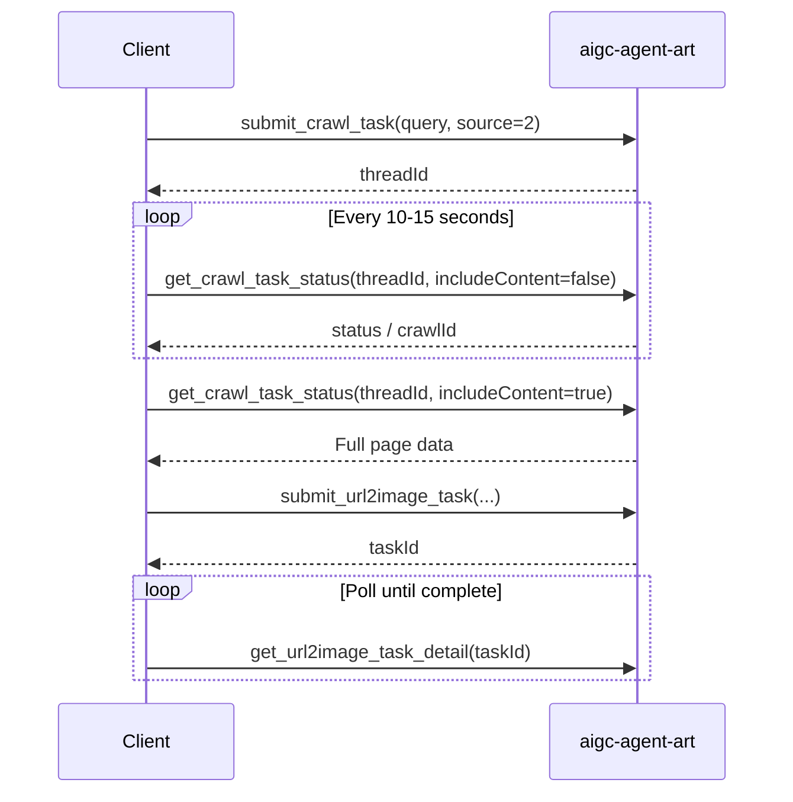

# kreadoai-mcp-skills

KreadoAI AIGC MCP integration guide. This document is based on the 20 tools currently exposed by the **aigc-agent-art** MCP server. Use it to integrate KreadoAI image generation, ad creatives, video, digital human, TTS, and related capabilities in MCP-compatible clients such as Cursor and Claude Desktop.

> [中文版 README](./README.md)

## Overview

| Item | Description |
|------|-------------|
| Server name | `aigc-agent-art` |
| Capabilities | AI image generation, multi-size ad creatives, URL-based ad images, image/text-to-video, web crawling, digital human lip-sync, TTS, subtitle/watermark removal |
| Billing | Some capabilities consume K Coins; check balance and quotas via `get_my_user_detail` |
| Authentication | Relies on session user context; no `userId` parameter required; only the current logged-in user's tasks can be accessed |

## Connect in Cursor

Add the server in Cursor MCP settings (`Settings → MCP`, or project/user-level `mcp.json`). Use the connection URL and auth details provided by KreadoAI. Example:

```json
{
  "mcpServers": {
    "aigc-agent-art": {
      "url": "https://api.kreadoai.com/mcp/agentart/v1/mcp",
      "headers": {
        "Authorization": "<your-token>"
      }
    }
  }
}
```

Restart Cursor after configuration. Tools become available in Agent conversations. The actual tool list is determined by what your MCP client syncs from the server.

## Common Conventions

### Async Task Pattern

Most generation APIs follow a **submit + poll** pattern:

1. Call `submit_*` to submit a task and receive `taskId` / `jobId` / `threadId`
2. Periodically call the corresponding `get_*` / `batch_get_*` to fetch results
3. Check status fields to determine completion

### Task Status Codes

| Scenario | Status values | Meaning |
|----------|---------------|---------|
| Image gen / ad images / URL2Image | 1 / 2 / 3 / 4 | Pending / Running / Success / Failed |
| Image-to-video | 1 / 2 / 3 / 4 | Pending / Success / Failed (see per-tool docs) |
| Digital human / subtitle removal | 1 / 2 / 3 / 4 / 5 | Pending / Running / Success / Failed / Timeout |
| Web crawl | RUNNING / SUCCESS / FAILED / NOT_FOUND | Running / Success / Failed / Not found or expired (TTL 24h) |

### File Input Structure (fileUrlList / imageInput, etc.)

Common fields when uploading or referencing files:

| Field | Description |
|-------|-------------|
| `fileSource` | `1` = platform-uploaded file (requires `fileId`); `2` = third-party URL (requires `fileUrl`); `3` = base64 (requires `fileUrl`) |
| `fileId` | Platform file ID |
| `fileUrl` | File URL or base64 content |
| `fileName` | File name; use a meaningful name when possible |
| `thumbnailFileUrl` | Thumbnail URL |

### Polling Recommendations

| Task type | Recommended interval | Max wait |
|-----------|---------------------|----------|
| Web crawl | 10–15 seconds | 15 minutes |
| Image/text-to-video | 10–30 seconds | Depends on model |
| Image / ad generation | 5–15 seconds | Depends on complexity |
| Digital human / subtitle removal | 10–30 seconds | Depends on queue |

### Rate Limits

- `text_to_speech`: at most 1 request per second
- `submit_system_lip_task`: at most 1 submission per second; server queues up to 8 tasks

---

## Tool Reference

### User & Account

| Tool | Description | Required params |
|------|-------------|-----------------|
| `get_my_user_detail` | Query current user account, membership, K Coin balance, quotas, etc. | None |

### AI Image Generation

| Tool | Description | Required params |
|------|-------------|-----------------|
| `submit_ai_image_task` | Text-to-image / image-to-image; returns task ID | `userPrompt`, `quantity`, `modelsSource` |
| `get_ai_image_task_detail` | Query image generation task result | `taskId` |
| `resubmit_ai_image_task` | Regenerate using original task parameters | `taskId` |

**modelsSource model codes:**

| Value | Model |
|-------|-------|
| 2 | google-gemini-2.5-flash-image |
| 3 | doubao-seedream-4.0 |
| 5 | google-gemini-3-pro-image |
| 6 | doubao-seedream-4.5 |
| 7 | doubao-Seedream-5.0-lite |
| 8 | google-gemini-3.1-flash-image |
| 9 | gtp-image-2 (prefer newer models when available) |

**Common optional params:** `sizeRatio` (e.g. `16:9`, `1:1`), `dpi` (`512`/`1k`/`2k`/`4k`), `fileUrlList` (reference images), `width`/`height` (required for Doubao models 3/6/7), `webSearch`, `seed`, `thinkingLevel`.

### Multi-Size Ad Creatives

| Tool | Description | Required params |
|------|-------------|-----------------|
| `submit_ai_ad_creative_batch_image` | Upload product images and batch-generate multiple platform sizes | `fileUrlList`, `imageSizeList` |
| `get_ai_ad_creative_batch_image_detail` | Query batch generation results | `taskId` |

**layout:** `1` = original layout, `2` = AI smart layout, `3` = custom layout (requires `referenceFileList`).

**imageSizeList example:**

```json
[
  { "width": 1080, "height": 1920, "sizeRatio": "9:16" },
  { "width": 1200, "height": 628, "sizeRatio": "1.91:1" }
]
```

### URL-Based Ad Images (crawl page first)

| Tool | Description | Required params |
|------|-------------|-----------------|
| `submit_crawl_task` | Crawl product page / landing page | `query` (URL) |
| `get_crawl_task_status` | Query crawl progress and results | `threadId` |
| `submit_url2image_task` | Generate ad images from crawl results | `generationMode`, `quantity`, `sizeRatio`, `dpi` |
| `get_url2image_task_detail` | Query URL ad image task result | `taskId` |

**Recommended flow:**



**generationMode:** `1` = AI auto creative, `2` = template-based (requires `templateId`).

**sizeRatio options:** `16:9`, `9:16`, `1:1`, `4:3`, `3:4`, `2:3`, `3:2`, `4:5`, `5:4`, `21:9`.

### Image-to-Video / Text-to-Video

| Tool | Description | Required params |
|------|-------------|-----------------|
| `submit_image_to_video_task` | Submit image-to-video or text-to-video task | `taskType`, `modelSource`, `pageSource`, `promptWord`, `configOptions` |
| `batch_get_image_to_video_detail` | Batch query video tasks (must poll after submit) | `taskIds` |

**Key parameters:**

- `taskType`: `Image To Video` (requires main image) or `Text To Video` (no main image)
- `pageSource`: always pass `I2V` for MCP calls
- Main image (I2V): one of `imageFileId` / `imageUrl` / `imageInput`
- `configOptions`: includes `duration`, `resolution`, `ratio`, `usedReference`, `generateAudio`, etc.; **must match `modelSource` enums and K Coin price table**, otherwise returns "parameter error"

**configOptions.usedReference:**

| Value | Description |
|-------|-------------|
| `none` | Single image or no reference |
| `first-last` | First and last frame (2 images required) |
| `reference` | Multiple reference images (1–9) |
| `multimodal-reference` | Multimodal reference (image/video/audio mix) |
| `video-continuation` | Video continuation (wan2.7-i2v only) |

**Polling:** `taskStatus=1` keep waiting; `=2` read `videoUrl`; `=3/4` read `errorZhMsg` / `errorEnMsg`.

> Each `modelSource` supports many `ratio` / `resolution` / `duration` combinations. See tool schema for details. Confirm the triple matches the K Coin price table before submitting.

### Digital Human Video

| Tool | Description | Required params |
|------|-------------|-----------------|
| `get_digital_human_avatar_list` | Paginated list of digital human avatars | `cloneDigitalHuman`, `supportTypeId`, `pageIndex`, `pageSize` |
| `submit_system_lip_task` | Submit lip-sync synthesis task | `taskName`, `videoRatio`, `digitalHumanId` + audio |
| `get_lip_video_result` | Query synthesis result | `jobId` |

**supportTypeId:** `100` = photo digital human, `101` = video digital human.

**videoRatio:** `1` = 16:9, `2` = 9:16.

**Audio source:** call `text_to_speech` first to obtain `audioUrl` / `audioId`, then pass to `submit_system_lip_task`.

### Text-to-Speech (TTS)

| Tool | Description | Required params |
|------|-------------|-----------------|
| `get_voice_language_list` | List supported languages | None |
| `get_voice_list` | Paginated voice list | `language`, `pageIndex`, `pageSize`, `voiceClone` |
| `text_to_speech` | Synthesize text to MP3 | `languageId`, `content`, `voiceId`, `voiceClone`, `voiceSource` |

**voiceSource:** `1` = Microsoft, `3` = Alibaba, `4` = ByteDance, `5` = minimax, `6` = Google, `21` = ElevenLabs.

### Subtitle / Watermark Removal

| Tool | Description | Required params |
|------|-------------|-----------------|
| `submit_subtitle_removal_task` | Submit removal task | `taskName`, `srcFileUrl` |
| `get_subtitle_removal_result` | Query removal result | `jobId` |

**Region coordinates:** `rectAreaList` (subtitle boxes), `customRectAreaList` (watermarks); each item has `lt_x`, `lt_y`, `rb_x`, `rb_y`.

---

## Typical Integration Flows

### 1. Text-to-Image

```
get_my_user_detail                    → Confirm K Coin balance
submit_ai_image_task                  → Get taskId
get_ai_image_task_detail (poll)       → Read image URLs when status=3
```

### 2. Multi-Size Ad Creatives from Product Images

```
submit_ai_ad_creative_batch_image     → Pass product images + size list
get_ai_ad_creative_batch_image_detail   → Poll until success
```

### 3. Ad Images from Product Page URL

```
submit_crawl_task (source=2)
get_crawl_task_status (poll)
submit_url2image_task
get_url2image_task_detail (poll)
```

### 4. Image-to-Video

```
submit_image_to_video_task            → pageSource=I2V, pass main image + configOptions
batch_get_image_to_video_detail       → Poll taskIds every 10-30 seconds
```

### 5. Digital Human Spokesperson Video

```
get_digital_human_avatar_list         → Choose digitalHumanId
get_voice_language_list
get_voice_list
text_to_speech                        → Get audioUrl / audioId
submit_system_lip_task
get_lip_video_result (poll)
```

---

## Usage Examples (Cursor Agent)

With MCP configured, you can drive the Agent with natural language, for example:

- "Generate a 16:9 e-commerce hero image with gtp-image-2, prompt: …"
- "Crawl https://example.com/product and generate 4 square ad images"
- "Turn this image into a 5-second 9:16 image-to-video with the Doubao model"
- "Check my K Coin balance, then synthesize a Chinese female voiceover and create a digital human video"

The Agent will select the appropriate `submit_*` and `get_*` tools and poll according to the rules above.

---

## Notes

1. **Task ownership:** Operations such as `resubmit_ai_image_task` only apply to tasks owned by the current session user.
2. **Crawl polling:** During polling, use `includeContent=false` in `get_crawl_task_status`; set `true` after SUCCESS to fetch full data and avoid large-response parse failures.
3. **Video parameters:** `modelSource` + `duration` + `resolution` must satisfy both model enums and the K Coin price table. Common failures: Kling:3.0-Omni + `usedReference=none`, Doubao-seedance-fast-2 + 1080P.
4. **File URLs:** `srcFileUrl` for subtitle removal must not contain Chinese characters or special characters.
5. **Tool sync:** This document follows the current MCP tool schemas. If the server upgrades and fields change, rely on the tool definitions synced by your MCP client.

---

## Tool Index (20 tools)

| # | Tool | Category |
|---|------|----------|
| 1 | `get_my_user_detail` | Account |
| 2 | `submit_ai_image_task` | AI image |
| 3 | `get_ai_image_task_detail` | AI image |
| 4 | `resubmit_ai_image_task` | AI image |
| 5 | `submit_ai_ad_creative_batch_image` | Multi-size ads |
| 6 | `get_ai_ad_creative_batch_image_detail` | Multi-size ads |
| 7 | `submit_crawl_task` | URL ad images |
| 8 | `get_crawl_task_status` | URL ad images |
| 9 | `submit_url2image_task` | URL ad images |
| 10 | `get_url2image_task_detail` | URL ad images |
| 11 | `submit_image_to_video_task` | Video |
| 12 | `batch_get_image_to_video_detail` | Video |
| 13 | `get_digital_human_avatar_list` | Digital human |
| 14 | `submit_system_lip_task` | Digital human |
| 15 | `get_lip_video_result` | Digital human |
| 16 | `get_voice_language_list` | TTS |
| 17 | `get_voice_list` | TTS |
| 18 | `text_to_speech` | TTS |
| 19 | `submit_subtitle_removal_task` | Subtitle removal |
| 20 | `get_subtitle_removal_result` | Subtitle removal |
